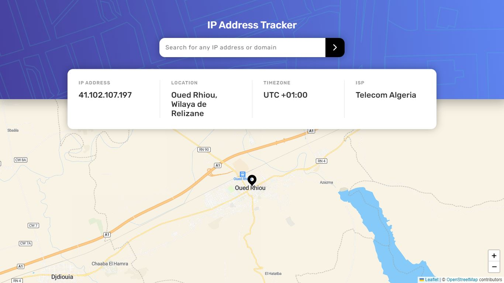
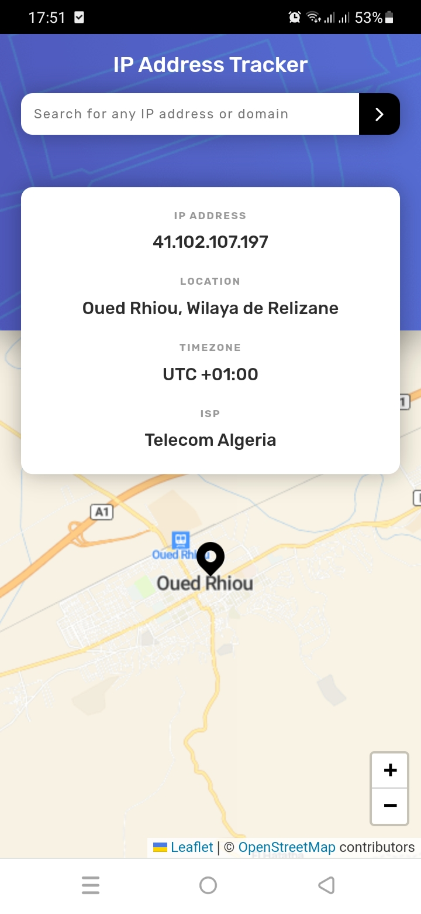

# Frontend Mentor - IP address tracker solution

This is a solution to the [IP address tracker challenge on Frontend Mentor](https://www.frontendmentor.io/challenges/ip-address-tracker-I8-0yYAH0). Frontend Mentor challenges help you improve your coding skills by building realistic projects.

## Table of contents

- [Frontend Mentor - IP address tracker solution](#frontend-mentor---ip-address-tracker-solution)
  - [Table of contents](#table-of-contents)
  - [Overview](#overview)
    - [The challenge](#the-challenge)
    - [Screenshots](#screenshots)
    - [Links](#links)
  - [My process](#my-process)
    - [Built with](#built-with)
    - [What I learned](#what-i-learned)
  - [Author](#author)

## Overview

### The challenge

Users should be able to:

- View the optimal layout for each page depending on their device's screen size
- See hover states for all interactive elements on the page
- See their own IP address on the map on the initial page load
- Search for any IP addresses or domains and see the key information and location

### Screenshots
Desktop view

Smartphone view

### Links

- Solution URL: [Github repo](https://github.com/abdelkadir-bouziane/ip-address-tracker-master)
- Live Site URL: [Live site](https://abdelkadir-bouziane.github.io/ip-address-tracker-master)

## My process

### Built with

- [React](https://reactjs.org/) - JS library
- CSS custom properties

### What I learned

- I practiced using the react hooks (useState, useEffect and useContext)
- I learned how to identify the IP address of my website's visitors by using the [Geolocation DB API](https://geolocation-db.com/)
- I learned how to get different information, such as location, about a specific IP address by using [IP Geolocation API by IPify](https://geo.ipify.org/)
- I learned to use Maps in react by using the react package [React Leaflet](https://react-leaflet.js.org/)

## Author

- Frontend Mentor - [@abdelkadir-bouziane](https://www.frontendmentor.io/profile/abdelkadir-bouziane)
- Github - [abdelkadir-bouziane](https://github.com/abdelkadir-bouziane)
